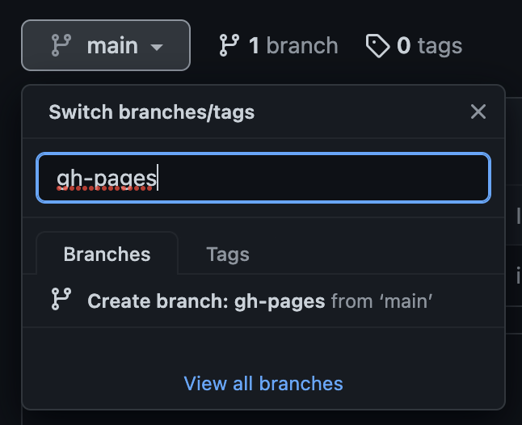
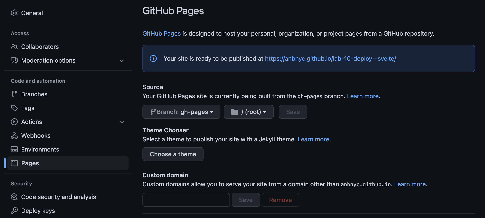

## Deploy

**Note**: This process makes use of a `vue-app` directory in the top level of this directory.

### Objective (Part 1)

**Deploy to GitHub pages by building locally and pushing to the `gh-pages` branch**

1. If it doesn't already exist, create a `gh-pages` branch. Then change your repo's settings to deploy to GitHub pages:





2. Make framework-specific configurations

| Vue                                                     |
| ------------------------------------------------------- |
| Create a `vue.config.js` (or update your existing one): |

```
module.exports = {
    publicPath: process.env.NODE_ENV === 'production'
        ? '/thesis/'
        : '/'
}
```

3. Copy the shell script from this lab to your app root. Run it with a local variable for your thesis repo's remote URL. For example:

```bash
URL=https://github.com/danielsauter/thesis bash local-build-vue.sh
```